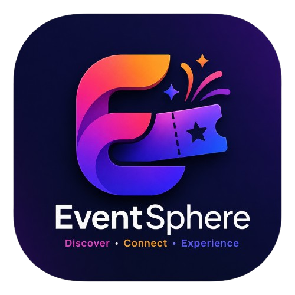
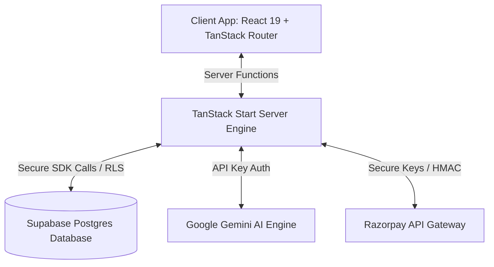
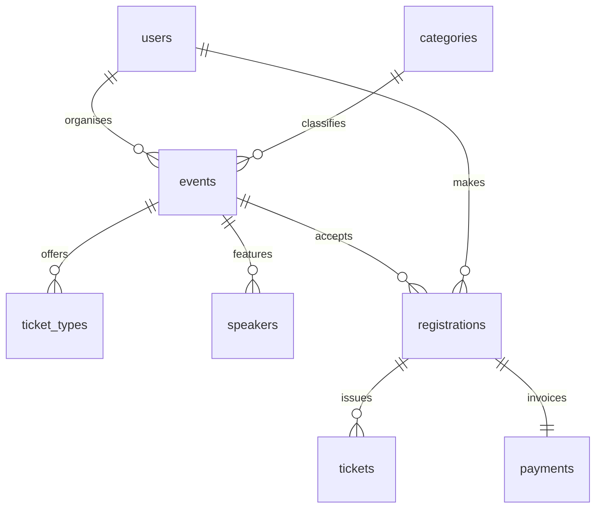

# 🌐 EventSphere — AI-Powered Event Management & Ticketing Platform

<div align="center">
  
  

  <p align="center">
    <strong>A next-generation, high-performance, real-time event booking, management, and ticketing ecosystem powered by intelligent AI and robust role isolation.</strong>
  </p>

  [](#)
  [](https://www.typescriptlang.org/)
  [](https://react.dev/)
  [](https://tanstack.com/start)
  [](https://supabase.com/)
  [](https://tailwindcss.com/)
  [](https://deepmind.google/technologies/gemini/)
  [](https://razorpay.com/)

</div>

---

## 📖 Elevator Pitch

**EventSphere** is a premium, secure, and real-time ticketing and event management ecosystem designed specifically to wow hackathon judges, recruiters, and modern developers alike. Operating on a robust **React 19 + TanStack Start** SSR core, the platform seamlessly coordinates with **Supabase (PostgreSQL + RLS + Realtime)** to offer lightning-fast client responses, ironclad security policies, and high-fidelity page rendering. 

From **AI-generated copywriting and schedule builders (Google Gemini)** to **secure server-side payment processing (Razorpay)**, and **real-time check-in consoles with QR codes**, EventSphere represents the gold standard of modern SaaS applications.

---

## ✨ Key Features

### 👤 Attendee Features
- **Intelligent Event Discovery**: Filter, search, and browse categories of local or virtual events with curated lists and rapid performance.
- **Dynamic Ticket Booking**: Intuitive registration flow. Includes an immediate bypass for free events and a robust Razorpay portal for paid options.
- **Instant QR Tickets**: High-resolution, client-rendered QR codes automatically generate post-registration for effortless physical check-ins.
- **Wishlist Watcher**: Save events instantly to a personalized wishlist, stored and synchronized across all active devices.
- **Verified Event Reviews**: Review past events with dynamic star ratings and descriptions to share feedback with organizers.

### 🏢 Organiser Features
- **Comprehensive Event Builder**: Create, update, and manage rich events featuring multiple ticket tiers, dates, and locations.
- **Rich Analytics Panel**: Keep track of ticketing volume, attendee counts, categorizations, and revenue growth using real-time graphical representations.
- **Live Check-In Console**: Seamlessly check in attendees manually or via a built-in scanner terminal with instant database state updates.
- **Automated Payout Tracker**: Clear accounting view displaying processing, pending, and settled transaction logs.

### 👑 Admin Features
- **Centralized User Control**: Review, edit, and instantly suspend users. Suspension activates a **background security watchdog** that forces immediate logout.
- **Global Event Moderation**: Actively review, feature, or delete listings to maintain safety and compliance across the platform.
- **Refund Dispute Solver**: Approve or reject payment refund requests with a single click, integrating directly with payment history profiles.

### 🧠 Advanced AI Features
- **Generative Event Copywriter**: Provide raw bullet points and allow **Google Gemini** to craft professional, marketing-grade event descriptions in seconds.
- **Smart Schedule Optimizer**: Automatically structures chronological event timelines, placing networking slots, lunch breaks, and keynotes into logical intervals.
- **Resilient Fallback Engine**: If Gemini API quotas are exhausted, a smart template compiler seamlessly handles request loads to guarantee zero UI crashes.

---

## 🛠️ Technology Stack

| Segment | Technology | Description |
| :--- | :--- | :--- |
| **Frontend** | **React 19, TanStack Start** | High-performance Server-Side Rendering (SSR) & Server Functions. |
| **Styling & UI** | **Tailwind CSS, shadcn/ui, Framer Motion** | Beautiful curated styling with dark/light themes, custom components, and smooth micro-animations. |
| **Database** | **PostgreSQL (Supabase)** | Robust tabular design with foreign key cascades, triggers, and indices. |
| **Realtime Engine** | **Supabase Realtime & WebSockets** | Instantly syncs check-ins, notifications, and user blocklists across terminals. |
| **Auth & Security** | **Supabase Auth & Row-Level Security (RLS)** | Custom authentication middleware with field-level RLS policies. |
| **Integrations** | **Razorpay & Google Gemini AI** | Secure payment orchestration (HMAC-SHA256 signature verification) and intelligent copy/schedule generation. |

---

## 🏛️ Architecture & Database Diagram

EventSphere uses a secure server-function execution model to prevent secret key leakage. Server functions interact directly with database clients while returning strictly typed schemas to the client interface.



### 🗄️ Relational Database Schema

The database features 20+ tables secured with strict Postgres RLS policies to prevent Cross-Tenant access.



---

## 📂 Folder Structure

```
Event Sphere/
├── public/                     # Public static assets
│   ├── assets/
│   │   ├── Event_Sphere_logo.png
│   │   └── favicon/            # Multi-format favicon structures
│   ├── og-image.png            # Generated high-resolution Open Graph image
│   ├── robots.txt              # Search engine crawler policies
│   └── sitemap.xml             # Main sitemap coordinates
├── src/
│   ├── components/             # Reusable UI & Layout components
│   │   ├── auth/               # Guards, session observers, login components
│   │   ├── shared/             # Navbar, Footer, Loading states, Event cards
│   │   └── ui/                 # Beautiful shadcn base components
│   ├── hooks/                  # Custom React hooks (React Query integrations)
│   ├── lib/                    # Constant values, utility helpers, and configurations
│   ├── routes/                 # File-based TanStack Router tree
│   │   ├── __root.tsx          # Global template containing structured JSON-LD
│   │   ├── admin/              # Admin moderation consoles
│   │   ├── auth/               # Access points (Login / Signup)
│   │   ├── categories/         # Dynamic category listings
│   │   ├── dashboard/          # Attendee dashboards & ticketing views
│   │   ├── events/             # Discovery and detailed description panels
│   │   └── organiser/          # Organiser events and payout management
│   ├── schemas/                # Shared Zod validation schemas
│   └── server/                 # Server-side API endpoints & integrations
└── supabase/
    └── migrations/             # Standardized PostgreSQL migrations
```

---

## 🔒 Security & Data Isolation Profile
- **Row-Level Security (RLS)**: Enforced globally. Users can only fetch registrations and ticket history containing their authenticated `user_id`.
- **Pre-Gate Account Status Check**: Every route guard runs a strict pre-flight check. If the database profile `is_active` flag is flipped to `false`, access is immediately denied.
- **Forced Watchdog Termination**: A real-time listener observes the active profile. If a user is suspended, a websocket signal triggers an instant `supabase.auth.signOut()`, rendering session cookies invalid and erasing active caches.
- **Server Function Protection**: Payment verification checks and Gemini completions run inside sandboxed server environments, protecting payment secrets and API key configurations from browser inspection.

---

## ⚙️ Environment Variables

Prepare a `.env` file in the root directory:

```env
# Supabase Core Config (Client & Server)
VITE_SUPABASE_URL=https://your-project-ref.supabase.co
VITE_SUPABASE_ANON_KEY=your-supabase-anon-key

# Google Gemini AI Integrations (Server Only)
GEMINI_API_KEY=your-google-gemini-api-key

# Razorpay Payment Gateway (Server Only)
RAZORPAY_KEY_ID=your-razorpay-key-id
RAZORPAY_KEY_SECRET=your-razorpay-key-secret
```

---

## 🚀 Installation & Local Setup

Follow these steps to run a completely functional development clone locally:

### 1. Pre-requisites & Node Installation
Ensure you have **Node.js (v18+)** installed. Clone the repository and run:
```bash
npm install
```

### 2. Database & Schema Initialization
Create a new project on **Supabase**. Navigate to the **SQL Editor** of your project and run the migration scripts located in `supabase/migrations/` sequentially:
1. **`001_schema.sql`**: Configures database structure, custom types, and default tables.
2. **`002_rls_policies.sql`**: Attaches Row-Level Security rules.
3. **`003_storage.sql`**: Registers file upload buckets for speaker portraits and banners.
4. **`004_functions.sql`**: Binds backend triggers, such as auto-syncing authentication profiles.
5. **`005_seed.sql`**: Populates categories, sample tech events, reviews, and test users.

### 3. Run Development Server
Once dependencies are configured and the environment variables are saved, boot up the local dev server:
```bash
npm run dev
```
The application will begin serving at **`http://localhost:3000`**.

---

## ⚡ Production Deployment (Vercel)

EventSphere is fully configured and optimized for zero-overhead deployments on **Vercel**:

1. Push your active codebase changes to your private/public **GitHub** repository.
2. Log into your **Vercel Dashboard** and click **Add New > Project**.
3. Select and import the cloned repository.
4. Open the **Environment Variables** accordion and paste your production API secrets (`VITE_SUPABASE_URL`, `GEMINI_API_KEY`, etc.).
5. Click **Deploy**. Vercel will automatically identify TanStack Start and output serverless edge functions for all server pipelines.

---

## 🗺️ Future Roadmap
- [ ] **Facial Recognition Check-in**: Integrate automated scan portals for touchless entry verification.
- [ ] **Offline Booking Synchronizer**: Cache ticket purchases locally inside service workers, syncing once internet connections stabilize.
- [ ] **Multi-currency Gateway Routing**: Support global booking currencies by dynamically routing payments based on user locales.

---

## 👥 Contributors & Team

- **EventSphere Engineering Team** — *Leading development, database modeling, and design architecture.*

---

## 📄 License

This project is licensed under the **MIT License**. Check out the license files for details.
